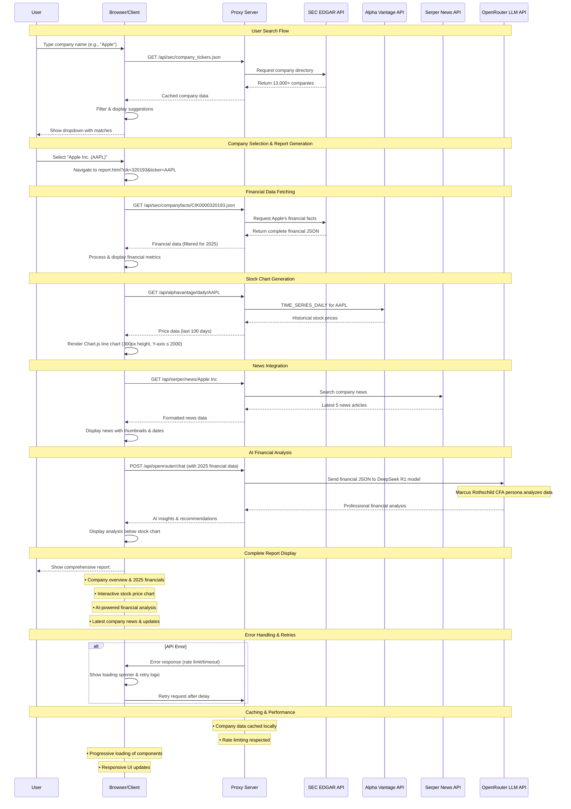

# SEC EDGAR Financial Analysis Platform

[](https://nodejs.org/)
[](https://developer.mozilla.org/en-US/docs/Web/JavaScript)
[](https://www.chartjs.org/)
[](LICENSE)

A professional financial analysis platform that transforms SEC EDGAR data into interactive reports with AI-powered insights, real-time stock charts, and comprehensive news integration.


## 🚀 Quick Start

### Prerequisites

- **Node.js** 18+ (LTS recommended)
- **Modern Browser** (Chrome 90+, Firefox 88+, Safari 14+, Edge 90+)

### Installation & Setup

```bash
# Clone the repository
git clone https://github.com/sharkoil/edgar-financial-app.git
cd edgar-financial-app

# Start the proxy server
node proxy-server.js

# Open your browser
# Navigate to http://localhost:8080
```

### First Usage

1. **Search for a company** (e.g., "Apple" or "AAPL")
2. **Select from dropdown** suggestions
3. **View comprehensive report** with:
   - 📊 2025 Financial Data (SEC EDGAR)
   - 📈 Interactive Stock Charts (Alpha Vantage)
   - 🤖 AI Financial Analysis (OpenRouter LLM)
   - 📰 Latest Company News (Serper API)

## 📋 Features

### 🎯 Core Functionality

- **🔍 Smart Search**: Real-time type-ahead across 13,000+ public companies
- **📊 Financial Reports**: Dynamic 2025 SEC EDGAR data processing and display
- **📈 Stock Charts**: Interactive price history with Chart.js (300px max height, Y-axis capped at 2000)
- **🤖 AI Analysis**: Professional financial analysis by "Marcus Rothschild, CFA" (30-year Wall Street veteran)
- **📰 News Integration**: Latest company news and market updates
- **🎨 Modern UI**: ChatGPT-inspired dark theme interface

### 🏗️ Technical Features

- **Zero Database**: Pure client-side processing with API integrations
- **CORS Proxy**: Node.js server handles cross-origin API requests
- **Real-time Data**: Live SEC filings, stock prices, and news
- **Responsive Design**: Mobile and desktop optimized
- **Error Handling**: Robust fallbacks and retry mechanisms

## 🏗️ Architecture

### System Overview

```
┌─────────────────┐    ┌──────────────────┐    ┌─────────────────┐
│   Browser       │    │   Node.js        │    │   External      │
│   Client        │◄──►│   Proxy Server   │◄──►│   APIs          │
│                 │    │   (Port 8080)    │    │                 │
└─────────────────┘    └──────────────────┘    └─────────────────┘
│                                                │
├─ Search Interface                              ├─ SEC EDGAR API
├─ Financial Reports                             ├─ Alpha Vantage API
├─ Stock Charts                                  ├─ Serper News API
├─ AI Analysis                                   └─ OpenRouter LLM API
└─ News Display
```

### Sequence Diagram - Complete User Flow



### Key Components

| Component | File | Purpose |
|-----------|------|---------|
| **Proxy Server** | `proxy-server.js` | CORS-enabled API gateway and static file server |
| **Search Engine** | `js/search.js` | Real-time company search with type-ahead |
| **Financial Parser** | `js/financial.js` | SEC EDGAR JSON processing and 2025 data filtering |
| **Stock Charts** | `js/stock-chart.js` | Interactive Chart.js implementation |
| **AI Analyst** | `js/llm-analyst.js` | OpenRouter LLM integration for financial analysis |
| **News Service** | `js/news.js` | Serper API integration for company news |
| **Report Generator** | `js/report.js` | Dynamic HTML report generation |

## 📁 Project Structure

```
edgar-financial-app/
├── index.html                 # ChatGPT-style home page
├── report.html               # Dynamic financial report page
├── proxy-server.js           # Node.js CORS proxy server
├── css/
│   └── style.css            # Dark theme styling
├── js/
│   ├── search.js            # Company search engine
│   ├── financial.js         # SEC EDGAR data processor
│   ├── stock-chart.js       # Chart.js integration
│   ├── llm-analyst.js       # AI financial analysis
│   ├── news.js              # News service integration
│   ├── report.js            # Report generation
│   ├── alphavantage.js      # Alpha Vantage API service
│   └── config.js            # API configuration
├── data/
│   └── companies.json       # Cached company directory
├── test-*.html              # Development testing pages
└── docs/
    ├── REQUIREMENTS.md      # Detailed requirements
    └── TECHNICAL_SPEC.md    # Technical specification
```

## 🔧 API Integrations

### SEC EDGAR API
- **Purpose**: Official financial data from SEC filings
- **Endpoint**: `https://data.sec.gov/api/xbrl/companyfacts/`
- **Data**: Balance sheet, income statement, cash flow (2025 only)
- **Rate Limit**: 10 requests/second

### Alpha Vantage API
- **Purpose**: Real-time stock price data
- **Function**: `TIME_SERIES_DAILY`
- **API Key**: `WNZ9Z35IUAUASVMV`
- **Rate Limit**: 5 requests/minute (free tier)

### Serper News API
- **Purpose**: Company news and market updates
- **API Key**: `b9719d19dcda85be1faa543b42b5a0a106529e63`
- **Features**: 5 latest articles per company
- **Rate Limit**: 2500 requests/month

### OpenRouter LLM API
- **Purpose**: AI-powered financial analysis
- **Model**: `deepseek/deepseek-r1-0528:free`
- **API Key**: `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`
- **Persona**: Marcus Rothschild, CFA (30-year Wall Street veteran)

## 🎨 User Interface

### Design System
- **Theme**: Dark mode inspired by ChatGPT
- **Primary Color**: `#10a37f` (Green accent)
- **Background**: `#1a1a1a` (Dark)
- **Text**: `#e0e0e0` (Light gray)
- **Typography**: System fonts (-apple-system, BlinkMacSystemFont, "Segoe UI")

### Key Screens

#### Home Page (`index.html`)
- ChatGPT-style search interface
- Real-time type-ahead suggestions
- Clean, minimal design

#### Financial Report (`report.html`)
- Dynamic content generation from SEC data
- Interactive stock price charts
- AI-generated financial analysis
- Latest company news feed

## 💻 Development

### Local Development

```bash
# Start the development server
node proxy-server.js

# The server will start on http://localhost:8080
# Changes to static files are reflected immediately
# Server restart required for proxy-server.js changes
```

### Testing

```bash
# Test API endpoints
open http://localhost:8080/test-api.html

# Test Alpha Vantage integration
open http://localhost:8080/alpha-vantage-demo.html

# Test OpenRouter LLM
open http://localhost:8080/test-openrouter.html

# Console-based news testing
node news-search.js
```

### Adding New Features

1. **New API Integration**: Add proxy route in `proxy-server.js`
2. **New UI Component**: Create service class in `js/` directory
3. **New Analysis**: Extend `FinancialDataProcessor` class
4. **New Chart Type**: Extend `StockChart` class

## 🚀 Deployment

### Development Deployment
```bash
# Simple deployment
node proxy-server.js
```

### Production Considerations
- **Process Management**: Use PM2 or similar for production
- **Environment Variables**: Set API keys via environment
- **HTTPS**: Add SSL termination for production use
- **Rate Limiting**: Implement additional API rate limiting

### Environment Variables
```bash
PORT=8080                    # Server port (optional)
NODE_ENV=production         # Environment mode
```

## 📊 Performance

### Benchmarks
- **Search Response**: < 500ms (type-ahead)
- **Financial Data**: < 3 seconds (complete report)
- **Chart Rendering**: < 2 seconds (stock charts)
- **AI Analysis**: < 10 seconds (LLM generation)

### Optimization Features
- **2025 Data Filtering**: Only current year data processed
- **Client-side Caching**: 5-minute news cache
- **Responsive Charts**: 300px height limit for performance
- **Debounced Search**: 200ms delay for optimal UX

## 🔒 Security

### API Key Management
- **Client-side Storage**: Development approach with embedded keys
- **Rate Limiting**: Respect all API provider limits
- **CORS Policy**: Wildcard origin for development

### Data Privacy
- **Public Data Only**: SEC filings are public information
- **No User Storage**: Application doesn't store user data
- **API Compliance**: Follows SEC EDGAR fair access guidelines

## 🛠️ Troubleshooting

### Common Issues

| Issue | Solution |
|-------|----------|
| **Port 8080 in use** | Kill existing process: `taskkill /F /PID [PID]` |
| **API rate limits** | Wait for rate limit reset or upgrade API plan |
| **Charts not loading** | Check Chart.js CDN availability |
| **Search not working** | Verify company data cache in `/data` folder |
| **AI analysis fails** | Check OpenRouter API key and model availability |

### Debug Tools
- **API Testing**: Use included test pages (`test-*.html`)
- **Console Logging**: Check browser developer tools
- **Network Analysis**: Monitor API calls in Network tab
- **Error Handling**: All components include error states

## 🔮 Future Enhancements

### Planned Features
- **Historical Analysis**: Multi-year trend analysis
- **Peer Comparison**: Industry benchmarking
- **Portfolio Management**: Multi-company tracking
- **Export Features**: PDF report generation
- **Real-time Updates**: WebSocket integration for live data

### Enhancement Areas
- **Performance**: Add service worker for offline capability
- **Analytics**: User interaction tracking
- **Visualization**: Additional chart types and indicators
- **AI Features**: Enhanced analysis with multiple LLM models

## 📚 Documentation

- **[Requirements Document](REQUIREMENTS.md)**: Detailed functional requirements
- **[Technical Specification](TECHNICAL_SPEC.md)**: Architecture and implementation details
- **[API Documentation](docs/API.md)**: Endpoint specifications and examples

## 🤝 Contributing

### Development Workflow
1. Fork the repository
2. Create feature branch (`git checkout -b feature/amazing-feature`)
3. Commit changes (`git commit -m 'Add amazing feature'`)
4. Push to branch (`git push origin feature/amazing-feature`)
5. Open Pull Request

### Code Standards
- **JavaScript**: ES6+ features, modern syntax
- **Comments**: JSDoc format for functions
- **Error Handling**: Try-catch blocks for all async operations
- **Performance**: Optimize for large JSON processing

## 📄 License

This project is licensed under the MIT License - see the [LICENSE](LICENSE) file for details.

## 👨‍💻 Author

**sharkoil**
- GitHub: [@sharkoil](https://github.com/sharkoil)
- Email: sharkoil@gmail.com

## 🙏 Acknowledgments

- **SEC EDGAR**: For providing free access to public financial data
- **Alpha Vantage**: For stock market data API
- **Chart.js**: For powerful charting capabilities
- **OpenRouter**: For LLM API access
- **Serper**: For news search capabilities

---

## 📊 Quick Demo

### Search Example
```
Type: "Apple"
Results: AAPL - Apple Inc.
Click: View Financial Report
```

### Sample Analysis Output
```
🎯 Professional Financial Analysis
Analysis by Marcus Rothschild, CFA • 30 Years Wall Street Experience

Apple Inc. demonstrates exceptional financial strength in 2025, with 
robust cash position of $165B and minimal debt burden. The company's 
margin expansion and consistent revenue growth indicate strong 
competitive positioning in the technology sector...
```

### Supported Companies
- **All NYSE/NASDAQ**: 13,000+ public companies
- **Popular Examples**: AAPL, MSFT, GOOGL, AMZN, TSLA, META, NVDA
- **International**: Many foreign companies with US listings

---

**Built with ❤️ for financial transparency and analysis**
